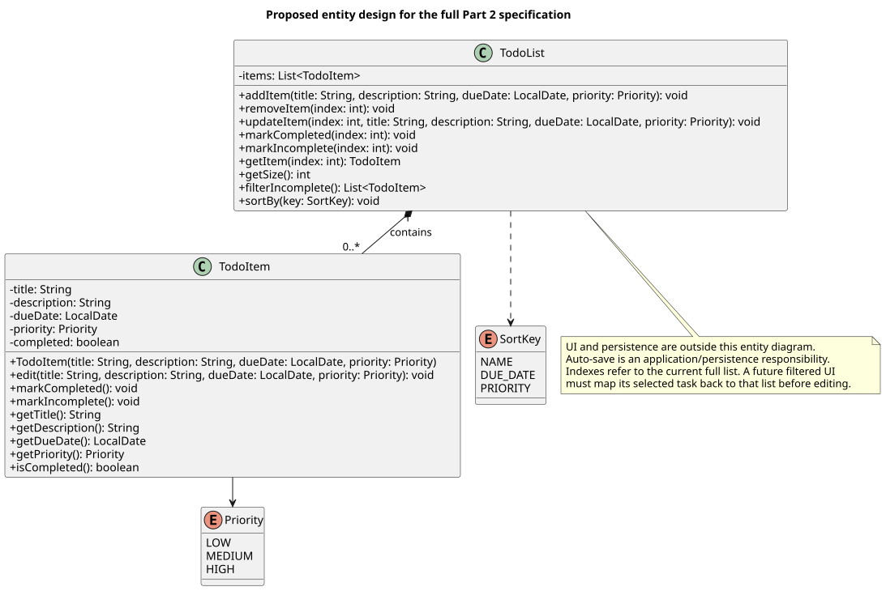
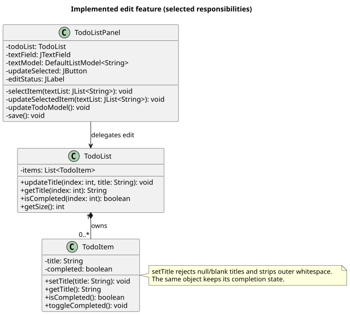

# CSC207 Lab 4 — Worked Solution and Study Guide

This file provides a worked example of the analysis, design, scenario walk-throughs, comparison, implementation decisions, and reflection for **Lab 4: From Specifications to Design**. Use it to prepare for the team discussion and explain the decisions in your own words; it is not a record of a team discussion or TA check-off.

The starter code is preserved on `main`. The instructor's supplied entity design is preserved on `entity-refactor`. The completed work is on `lab4-complete`.

## Open and run your completed branch

If you have not cloned your fork:

```bash
git clone --branch lab4-complete https://github.com/williamchenczy-boop/todo-list.git
cd todo-list
```

If it is already cloned, open its terminal and run:

```bash
git fetch origin
git switch lab4-complete
git pull --ff-only
```

Open `pom.xml` as a Maven project in IntelliJ, select JDK 11 or later, let Maven load dependencies, then run `src/main/java/csc207/app/Main.java`.

- **Add:** type a title and press Enter, even if a row is selected.
- **Edit:** select a row, change its title, click **Update Selected**.
- **Complete/uncomplete:** focus the list, select a row, press Space.
- **Delete:** focus the list, select a row, press Delete or Backspace.
- **Persist:** click **Save** after committing edits. Save does not commit text still being edited.

The course's [original lab instructions](README.md) remain available. The Part 5 in-lab exercise has a ten-minute limit and does not require a finished feature; this branch supplies a completed reference implementation for study. Description, due date, priority, filtering, sorting, and auto-save are design proposals below, not implemented features.

---

## Part 1 — What Can the Program Do?

### User-story support in the original `main` branch

| # | User story | Support | Evidence / observation |
|---|---|---|---|
| 1 | Add a todo item | Yes | Typing a task in the text field and pressing Enter appends it to the list. |
| 2 | View the todo list | Yes | Items are displayed in the Swing `JList`. |
| 3 | Mark an item as done | Yes | Select an item and press Space. |
| 4 | Unmark an item as done | Yes | Pressing Space again removes the done marker. |
| 5 | Remove an item | Yes | Select an item and press Delete/Backspace. |
| 6 | Edit an item | Partially | Selecting an item copies its text into the text field, but pressing Enter creates a new item instead of updating the selected one. |
| 7 | Filter completed/incomplete items | No | There is no filtering behaviour. |
| 8 | Sort by priority or due date | No | Priority and due date are not represented in the original model. |
| 9 | Save the todo list | Yes | The Save button writes the list to `saves/todo_list.json`. |
| 10 | Reopen the app and see saved items | Yes | The constructor loads the JSON file when the panel is created. |

### What happens when an existing task is selected?

The program copies the selected task text into the input field. This makes the interface look as though editing may be possible, but the existing Enter action still adds a new item instead of changing the selected one.

### Tracing “mark a todo item as done” in the original design

The relevant method is `toggleDone` in `TodoListPanel`.

1. The GUI gets the selected list index.
2. It reads the selected value from `DefaultListModel<String>`.
3. If the string already ends with `" (done)"`, that suffix is removed.
4. Otherwise, `" (done)"` is appended.
5. The modified string replaces the previous string in the list model.

#### What Java type represents a todo item?

A todo item is represented as a **`String`**, stored in a `DefaultListModel<String>`.

#### How is completion status represented?

Completion is encoded directly into the task's display string using the suffix:

```text
 (done)
```

For example:

```text
Study CSC207
Study CSC207 (done)
```

#### How does saving determine whether an item is completed?

The save logic checks:

```java
item.endsWith(DONE)
```

It then stores the result as the JSON `completed` boolean and strips the display suffix from the saved task title.

#### Evaluation of the original representation

This representation works for ordinary titles, but it mixes **domain state** with **presentation text**. A task whose literal title ends in `" (done)"` is mistaken for a completed task; the original save code also uses `replace(DONE, "")`, which removes matching text anywhere in the title. Whether a task is completed is part of the task itself, not part of how the GUI chooses to display the task. A better design uses a todo-item object with separate fields such as `title` and `completed`.

---

## Part 2 — From Specification to Design

### Noun–verb analysis

The important nouns in the specification are:

- **todo list** — candidate entity class: `TodoList`
- **task / todo item** — candidate entity class: `TodoItem`
- **title** — attribute of `TodoItem`
- **description** — attribute of `TodoItem`
- **due date** — attribute of `TodoItem`
- **priority level** — attribute of `TodoItem`; the priority values could be represented by an enum
- **completion state** — boolean attribute of `TodoItem`
- **persistent storage** — important system responsibility, but not necessarily a domain entity; it would be better separated into a persistence/data-access component in a larger design
- **user / application** — context for the system, not separate domain entities in this single-user specification

The important verb phrases and the responsibilities they suggest are:

| Verb / behaviour | Suggested responsibility |
|---|---|
| create/add a task | `TodoList.addItem` |
| edit a task | `TodoItem` changes its editable state, with `TodoList` locating the item |
| delete a task | `TodoList.removeItem` |
| mark a task completed | `TodoItem.markCompleted` / `toggleCompleted` |
| mark a task incomplete | `TodoItem.markIncomplete` / `toggleCompleted` |
| filter tasks | `TodoList` |
| sort tasks | `TodoList` |
| save/load tasks | persistence component rather than the entity itself |

The full specification calls for **automatic** saving. An application component should ask the persistence component to save after successful changes and load at startup. That orchestration is outside the entity-only UML. The starter and this edit implementation retain the existing manual Save button.

### Proposed entity design

The proposed design is stored in:

[PlantUML source](plantuml/StudentTodoListDesign.plantuml)



One `TodoList` contains zero or more `TodoItem` objects. `TodoList` owns the collection. Each `TodoItem` owns its own task-specific state. `Priority` and `SortKey` are enums, not independent task entities.

A `TodoItem` has:

- `title: String`
- `description: String`
- `dueDate: LocalDate`
- `priority: Priority`
- `completed: boolean`

A `TodoList` has:

- `items: List<TodoItem>`

This design keeps task state independent of Swing or any other user interface.

Design assumptions to discuss: description may be empty, a missing due date is represented by `null`, and priority defaults to MEDIUM when creating a task. Proposed ordering is alphabetical title, earliest due date first with undated items last, and HIGH priority first. Filtering returns matching item references without deleting other tasks. These are proposed requirements, not extra code in this branch.

---

## Part 3 — Scenario Walk-Through

### Scenario

> A user marks an incomplete todo item as completed.

### Walk-through

| Step | Responsible class | Information and collaboration | UML support |
|---|---|---|---|
| 1 | UI, outside the entity diagram | Identify the selected task's index in the current full list, e.g. `1` | UI calls the public entity API |
| 2 | `TodoList` | Receive `markCompleted(1)` and locate `items.get(1)` | `items` relationship and `markCompleted(index)` |
| 3 | `TodoList` and `TodoItem` | Delegate to the selected item's `markCompleted()` | Both methods appear on the diagram |
| 4 | `TodoItem` | Set its own `completed` field to `true` | `completed` field and mutation responsibility |
| 5 | UI and entities | Read `getItem(1).isCompleted()` and `getTitle()` to display updated state | All required query methods appear on the diagram |

Starting with an incomplete item, the final value is `true`; the title and list size are unchanged. Calling `markCompleted` again leaves it completed. This differs from `toggleCompleted`, which reverses the state each time.

### Design check

The first draft must therefore provide:

- a relationship from `TodoList` to its `TodoItem` objects;
- a way for `TodoList` to locate a specific item;
- a completion-changing responsibility on `TodoItem`;
- a way to read the updated state.

Example revision: an initial draft with only the fields and add/remove/edit methods would stop at step 2: the list has no completion-changing operation. Even with that operation added, step 3 also requires `TodoItem.markCompleted()`. Add both methods and the read operations, then restart at step 1. The final diagram above supports every step without another change. This is a worked example of a revision, not a claim about what happened in a live team discussion.

### Design decision to explain to the TA

**Completion state belongs to `TodoItem`, not to the GUI.**

The GUI may display completed tasks differently, but the task's completion status should exist even if the application later replaces Swing with another interface. Keeping the state in the entity separates domain information from presentation.

---

## Part 4 — Compare with the Supplied `entity-refactor` Design

The instructor's branch introduces two entity classes:

- `TodoItem`
- `TodoList`

### Similarity

Both the proposed design and the supplied design separate an individual task from the list that contains tasks. They also place completion state on the todo-item entity rather than encoding it in the display string.

### Difference

The proposed design follows the full written specification, so `TodoItem` includes title, description, due date, priority, and completion state.

The supplied lab design intentionally implements a smaller subset:

- `title`
- `completed`

The supplied design is enough to demonstrate the entity refactor without implementing every future feature in the specification.

### Where the GUI interacts with the entities

In the supplied branch, `TodoListPanel` owns:

```java
private final TodoList todoList;
```

Instead of changing the stored display string directly, the GUI calls methods on `TodoList`, such as:

```java
todoList.addItem(title);
todoList.removeItem(selectedIndex);
todoList.toggleCompleted(selectedIndex);
```

The panel then rebuilds the Swing list model from entity data. The dependency is therefore:

`TodoListPanel` calls `TodoList`, which delegates to `TodoItem`.

This is cleaner than using Swing's `DefaultListModel<String>` as the application's domain model.

---

## Part 5 — Edit a Todo Item

### Scenario walk-through before implementation

Chosen interaction for this implementation:

1. The user selects an existing item.
2. The existing selection behaviour copies its title into the text field.
3. The user changes the title in the text field.
4. The user clicks **Update Selected**.
5. `TodoListPanel` asks `TodoList` to update the selected item.
6. `TodoList` locates the `TodoItem`.
7. `TodoItem` updates its title.
8. The panel refreshes the Swing list while preserving the item's completed state.

### Design gap discovered

The instructor entity design originally contains:

```java
private final String title;
```

and provides no title-changing method.

Therefore, the edit scenario cannot be completed using the original entity design. The entity model needs a new responsibility before the GUI can implement the story cleanly.

### Minimal design changes

The implementation on `lab4-complete` makes the smallest required changes:

- `TodoItem.title` becomes mutable.
- `TodoItem` receives `setTitle(String title)`.
- `TodoList` receives `updateTitle(int index, String title)`.
- `TodoListPanel` receives an **Update Selected** button that delegates the change through `TodoList`.

The completed flag is not recreated or inferred from text, so editing a completed task preserves its completion state.



[Implemented diagram source](plantuml/ImplementedEditDesign.plantuml). The original instructor diagram, `plantuml/TodoList.plantuml`, is retained as the baseline for comparison.

### Why this responsibility placement?

The GUI should not reach inside `TodoItem` directly.

`TodoListPanel` knows which list position the user selected. `TodoList` owns the collection and can find that item. `TodoItem` owns its own title and changes it. This keeps each responsibility close to the state it controls.

---

## Stop and Reflect

### 1. Did the scenario walk-through reveal a needed class-design change?

Yes. The original supplied `TodoItem` makes `title` final and exposes no edit operation, so the edit user story cannot be completed without changing the entity design.

### 2. Decisions not specified by the user story

The short user story does not answer questions such as:

- What user action confirms an edit?
- Can a task be edited to an empty title?
- What happens if the user changes the text and selects another task before confirming the edit?
- Should editing affect completion status?
- Should editing support only the title or all task details?

For the implemented version, **Update Selected** is used as the explicit confirmation action, and changing the title does not change completion status.

The concrete provisional choices are:

| Behavioural question | Choice in this implementation |
|---|---|
| What confirms an edit? | Update Selected; Enter continues to add another item. |
| What if no task is selected? | Update Selected is disabled; no task changes. |
| What if the title is empty or all whitespace? | Show an inline message; keep the old title and selection so the user can correct the draft. |
| How is surrounding whitespace handled? | Strip leading/trailing whitespace on edits; preserve internal spacing. |
| What happens to completion, position, and selection? | Preserve all three. |
| Can two tasks have the same title? | Yes; update the selected index, not the first matching title. |
| What if selection changes before Update Selected? | Discard the uncommitted draft and show the newly selected task's title. |
| Does Save commit the text field? | No. It saves the current entity state; click Update Selected first. |
| Which details are editable? | Title only; the supplied code has no description/date/priority fields yet. |

The existing add operation remains unchanged, including its permissive handling of blank titles. New-title validation across all operations would be a separate requirement. The entity setter enforces edit validation even when called without the GUI.

### 3. Which decisions describe what the user should observe?

Examples of user-observable behavioural decisions:

- whether editing is confirmed with Enter, a button, or automatically;
- what happens with an empty title;
- what happens to unsaved text when selection changes;
- whether the item remains selected after editing.

### 4. Which decisions are internal design/implementation decisions?

Examples:

- making `TodoItem.title` mutable;
- placing `setTitle` on `TodoItem`;
- placing `updateTitle` on `TodoList`;
- having the Swing panel delegate rather than mutate entity internals.

### Two behavioural questions that should be answered before confidently implementing the feature

1. **What exact user action should commit an edit: pressing Enter, clicking an Update button, or changing focus?**
2. **What should happen if the user tries to save an empty or blank task title?**

These questions affect externally visible behaviour and therefore should be clarified as requirements rather than silently treated as Java implementation details.

The reference implementation uses provisional answers above; those choices are not prescribed by the course user story.

### Alternative design

Enter could commit edits whenever an item is selected, but then adding needs an explicit New/Add action or a clear way to exit edit mode. A separate Update button preserves the starter keyboard behavior. An immutable `TodoItem` could instead be replaced by a new object, but the replacement must explicitly preserve completion and list position. A mutable title is the smaller change here.

### Optional comparison with the original representation

Editing on `main` would mean replacing a selected string while separately remembering whether its old value ended in `DONE`, then appending that suffix if needed. It can take fewer lines, but titles containing the marker are ambiguous and presentation rules leak into the edit operation. In the entity version, updating the title never has to inspect or rebuild completion state. The original branch is preserved for comparison; optional extra user stories are not implemented.

## What to understand for your TA discussion

1. A user story expresses a goal but does not specify every interaction or validation rule.
2. Nouns suggest entities and attributes; verbs suggest responsibilities, not a mechanical one-to-one class/method list.
3. A scenario walk-through must use operations actually present in the UML.
4. `final String title` prevents reassignment of that field; String itself is still immutable after removing `final`. Editing assigns a different String to the field.
5. Editing follows `TodoListPanel.updateSelectedItem` → `TodoList.updateTitle` → `TodoItem.setTitle` and then refreshes the display.
6. Behavioral choices describe what users observe; implementation choices describe how code provides it.

---

## Verification and quick check

All four application classes and both test classes compiled targeting Java 11 with Eclipse ECJ 3.37.0 on Java 17. JUnit Platform 1.10.2 ran **8 tests: 8 passed, 0 failed**. Tests exercise entity validation, duplicate titles, literal `" (done)"` text, selected-row updates, completion preservation, selection changes, deletion, and JSON save/reload. Swing interactions run on the event dispatch thread in headless mode.

The UML sources were rendered with PlantUML and visually checked. `main` and `entity-refactor` were checked against their course branch commit IDs and remain unchanged. The Maven CLI and a desktop display were unavailable in the execution environment, so the project was compiled and tested directly with the compiler and JUnit jars; an interactive IntelliJ run remains a useful final local check.

To rerun the tests with a local JDK and Maven:

```bash
mvn test
```

IntelliJ can also run `TodoListTest` and `TodoListPanelTest`. Maven tests use `target/` for temporary save files; tests restore any pre-existing save contents when run directly from an IDE.

Quick interactive check: add two items, complete one, change its title with Update Selected, try a blank edit, click Save, close and reopen. Confirm that the edited item still has its completion state and that no extra item was created by Update Selected.

## Branches

- `main` — untouched original starter program.
- `entity-refactor` — untouched instructor-provided entity solution.
- `lab4-complete` — completed written analysis, student UML design, and working edit feature.
